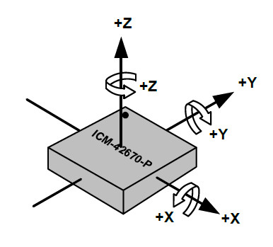
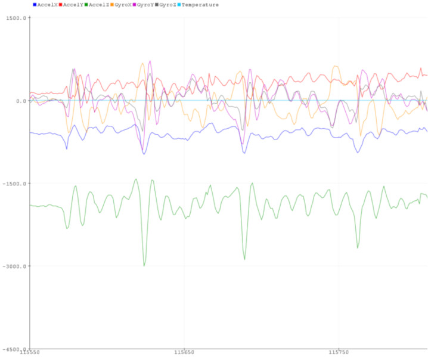

# ICM42670P Arduino library
This arduino library for the [TDK/Invensense ICM42670P High Performance 6-Axis MotionTracking<sup>(TM)</sup> IMU](https://invensense.tdk.com/products/motion-tracking/6-axis/icm-42670-p).
The ICM-42670-P is a high performance 6-axis MEMS MotionTracking device that combines a 3-axis gyroscope and a 3-axis accelerometer. It has a configurable host interface that supports I3C<sup>SM</sup>, I2C, and SPI serial communication, features up to 2.25 Kbytes FIFO and 2 programmable interrupts with ultra-low-power wake-on-motion support to minimize system power consumption.
This library supports both I2C and SPI commmunication with the ICM42670P.

# Software setup
Use Arduino Library manager to find and install the ICM42670P library.

# Hardware setup
There is currenlty no Arduino shield for the ICM42670P.
The wiring must be done manually between the Arduino motherboard and the ICM42670P daughter board.
The below wiring description is given for an Arduino Zero board, it depends on the interface to be used:
* I2C

|Arduino Zero|ICM42670P daughter board|
| --- | --- |
| 3V3        | CN4.9 & CN5.10 |
| GND        | CN5.9          |
| SDA        | CN5.4          |
| SCL        | CN5.6          |

* SPI

|Arduino Zero|ICM42670P daughter board|
| --- | --- |
| 3V3        | CN4.9 & CN5.10 |
| GND        | CN5.9          |
| MISO=SPI.1 | CN4.7          |
| MOSI=SPI.4 | CN5.4          |
| SCK=SPI.3  | CN5.6          |
| CS=DIG.8   | CN5.8          |

Note: SPI Chip Select can be mapped on any free digital IO, updating the sketches accordingly

* Interrupt

|Arduino Zero|ICM42670P daughter board|
| --- | --- |
| DIG.2        | CN4.1        |

Note: Interrupt pin can be mapped on any free interruptable IO, updating the sketches accordingly

## Orientation of axes

The diagram below shows the orientation of the axes of sensitivity and the polarity of rotation. Note the pin 1 identifier (•) in the
figure.



# Library API

## Create ICM42670P instance

**ICM42670P(TwoWire &i2c,bool lsb)**
Create an instance of the ICM42670P that will be accessed using the specified I2C. The LSB of the I2C address can be set to 0 or 1.

```C++
ICM42670P IMU(Wire,0);
```

**ICM42670P(SPIClass &spi,uint8_t cs_id)**
Create an instance of the ICM42670P that will be accessed using the specified SPI. The IO number to be used as chip select must be specified.

```C++
ICM42670P IMU(SPI,10);
```

**/!\ This library does NOT support multiple instances of ICM42670P.**


## Initialize the ICM42670P
Call the begin method to execute the ICM42670P initialization routine. 

**int begin()**

Initializes all the required parameters in order to communicate and use the ICM42670P.

```C++
IMU.begin();
```

## Log sensor data

**int startAccel(uint16_t odr, uint16_t fsr)**

This method starts logging with the accelerometer, using the specified full scale range and output data rate.
Supported ODR are: 12, 25, 50, 100, 200, 400, 800, 1600 Hz (any other value defaults to 100 Hz). 
Supported full scale ranges are: 2, 4, 8, 16 G (any other value defaults to 16 G).

```C++
IMU.startAccel(100,16);
```

**int startGyro(uint16_t odr, uint16_t fsr)**

This method starts logging with the gyroscope, using the specified full scale range and output data rate.
Supported ODR are: 12, 25, 50, 100, 200, 400, 800, 1600 Hz (any other value defaults to 100 Hz). 
Supported full scale ranges are: 250, 500, 1000, 2000 dps (any other value defaults to 2000 dps).

```C++
IMU.startGyro(100,2000);
```

**int getDataFromRegisters(inv_imu_sensor_event_t&ast; evt)**

This method reads the ICM42670P sensor data from registers and fill the provided event structure with sensor raw data.
Raw data can be translated to International System using the configured FSR for each sensor. Temperature in Degrees Centigrade = (TEMP_DATA / 128) + 25

```C++
inv_imu_sensor_event_t event;
IMU.getDataFromRegisters(&event);
Serial.print("Accel X = ");
Serial.println(imu_event.accel[0]);
Serial.print("Accel Y = ");
Serial.print(imu_event.accel[1]);
Serial.print("Accel Z = ");
Serial.print(imu_event.accel[2]);
Serial.print("Gyro X = ");
Serial.print(imu_event.gyro[0]);
Serial.print("Gyro Y = ");
Serial.print(imu_event.gyro[1]);
Serial.print("Gyro Z = ");
Serial.print(imu_event.gyro[2]);
Serial.print("Temperature = ");
Serial.println(imu_event.temperature);
```

**int enableFifoInterrupt(uint8_t intpin, ICM42670P_irq_handler handler, uint8_t fifo_watermark)**

This method initializes the fifo and the interrupt of the ICM42670P. The interrupt is triggered each time there is enough samples in the fifo (as specified by fifo_watermark), and the provided handler is called.
Any interuptable pin of the Arduino can be used for intpin.

```C++
uint8_t irq_received = 0;

void irq_handler(void)
{
  irq_received = 1;
}
...

// Enable interrupt on pin 2
IMU.enableFifoInterrupt(2,irq_handler);
```

**int getDataFromFifo(ICM42670P_sensor_event_cb event_cb)**

This method reads the ICM42670P sensor data samples stored in the FIFO and call the provided event handler with the sample event as parameter.
Raw data can be translated to International System using the configured FSR for each sensor. Temperature in Degrees Centigrade = (TEMP_DATA / 128) + 25

```C++
void event_cb(inv_imu_sensor_event_t *evt)
{
  Serial.print(evt->accel[0]);
  Serial.print(",");
  Serial.print(evt->accel[1]);
  Serial.print(",");
  Serial.print(evt->accel[2]);
  Serial.print(",");
  Serial.print(evt->gyro[0]);
  Serial.print(",");
  Serial.print(evt->gyro[1]);
  Serial.print(",");
  Serial.print(evt->gyro[2]);
  Serial.print(",");
  Serial.println(evt->temperature);
}

void loop() {
  // Wait for interrupt to read data from fifo
  if(irq_received)
  {
      irq_received = 0;
      IMU.getDataFromFifo(event_cb);
  }
}
```

**inv_imu_sensor_event_t**

This structure is used by the ICM42670P driver to return raw sensor data. Available data is:
|Field name|description|
| --- | --- |
| sensor_mask       | Mask describing available data         |
| timestamp_fsync   | Timestamp in us                        |
| accel[3]          | 3-axis accel raw data                  |
| gyro[3]           | 3-axis gyro raw data                   |
| temperature       | Temperature raw data (on 1 or 2 bytes) |
| accel_high_res[3] | 3- axis accel lsb in high resolution   |
| gyro_high_res[3]  | 3- axis gyro LSB in high resolution    |


# Available Sketches

**Polling_I2C**

This sketch initializes the ICM42670P with the I2C interface, and starts logging raw sensor data from IMU registers. Sensor data can be monitored on Serial monitor or Serial plotter

**Polling_SPI**

This sketch initializes the ICM42670P with the SPI interface, and starts logging raw sensor data from IMU registers. Sensor data can be monitored on Serial monitor or Serial plotter

**FIFO_Interrupt**

This sketch initializes the ICM42670P with the SPI interface and interrupt PIN2, and starts logging raw sensor data from IMU FIFO. Sensor data can be monitored on Serial monitor or Serial plotter

**IMU data monitoring**

When the ICM42670P IMU is logging, the Accelerometer, Gyroscope and Temperature raw data can be monitored with the Arduino Serial Plotter (Tools->Serial Plotter).



